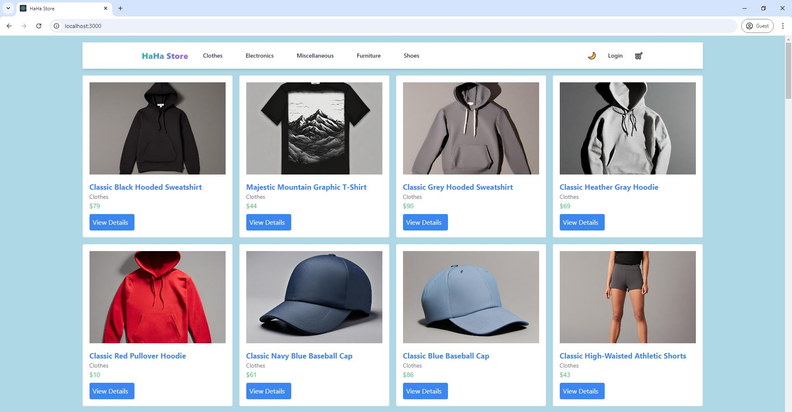
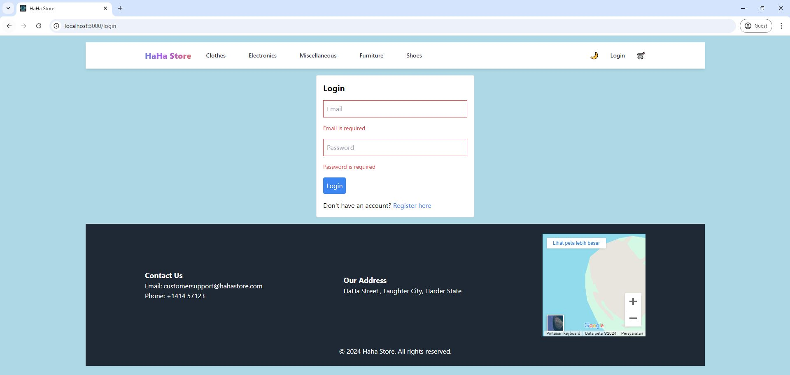
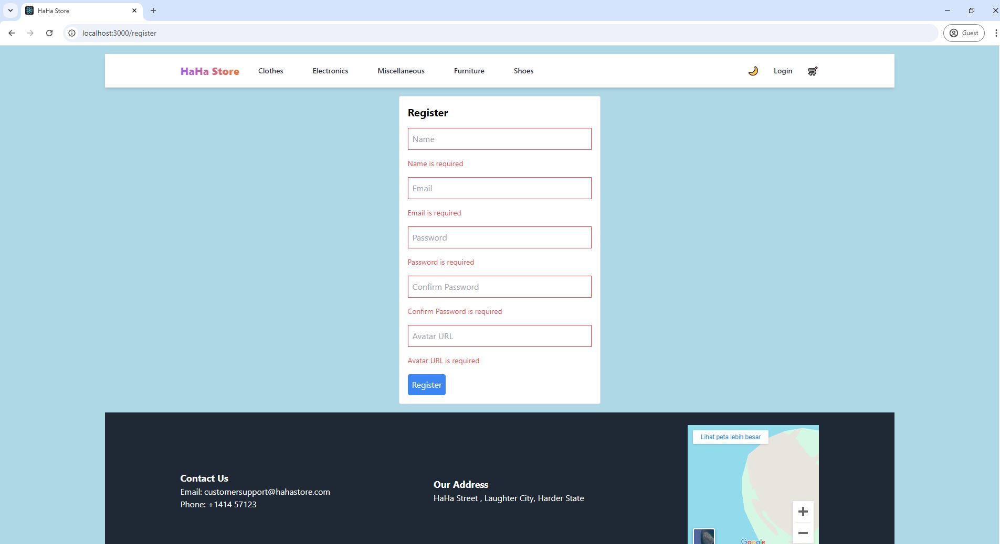
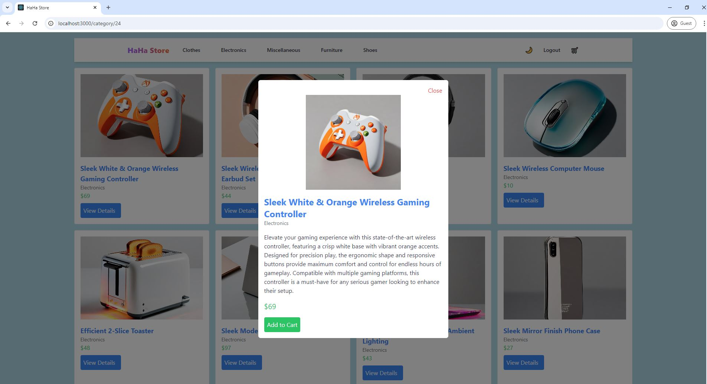
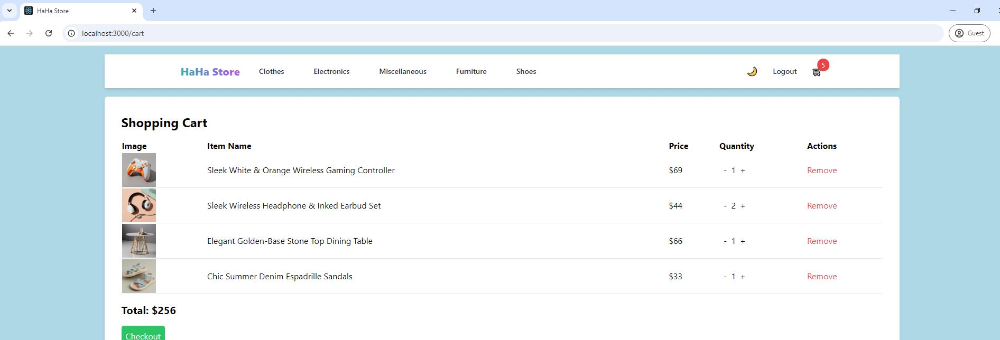

# Milestone-2 "Haha Store"
<p>HaHa Store An online shop that sells all your needs</p> 
<p>This store uses API [Platzi's Fake API](https://fakeapi.platzi.com/)</p>

## Features
1. Login and Register Page: Able to login and register via API
2. Product Listing Page: Display a list of products retrieved from the API.
3. Product Category Page: Display a list of products based on their category.
4. Product Detail Page: Show detailed information about a selected product including images, descriptions, and price.
5. Shopping Cart: Enable users to add products to a shopping cart and manage their selections.

### Installation
1. Clone the repository:

```
git clone https://github.com/revou-fsse-5/milestone-2-FabianusArdian.git
```

2. Install dependencies

```
npm install
```

3. Run the application:

```
npm start
```

4. Automated to open your lovely browser or Click local server in your terminal

### Images
All Products and Categories


Register and Login Form




Product Detail Page


Cart Page



### Deployment Link

[https://milestone-2-hahastore.vercel.app/](https://milestone-2-hahastore.vercel.app/)